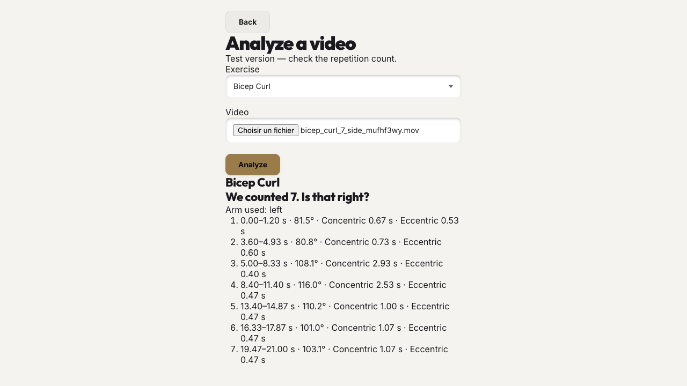
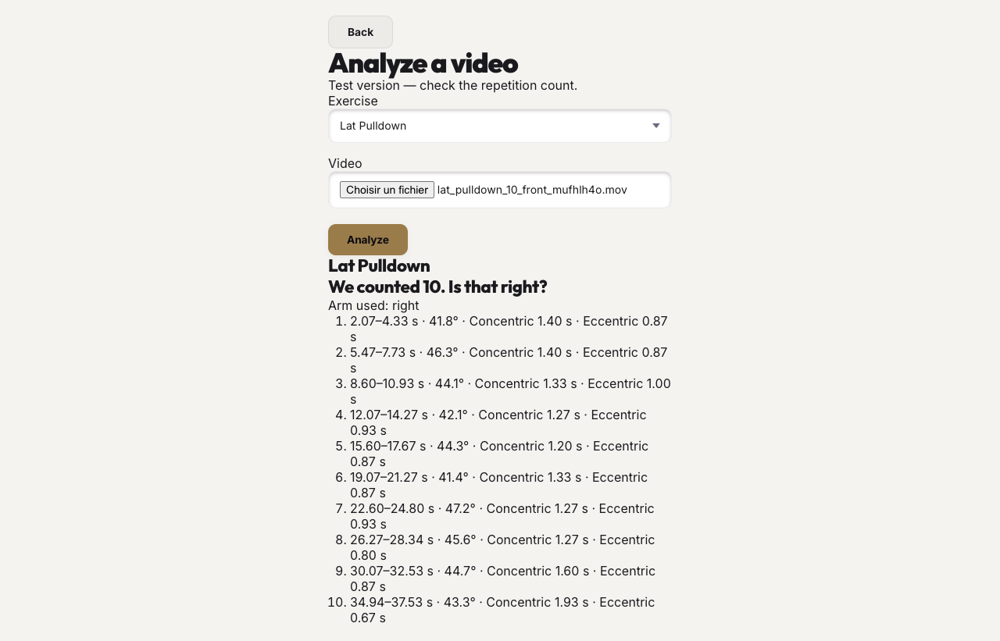
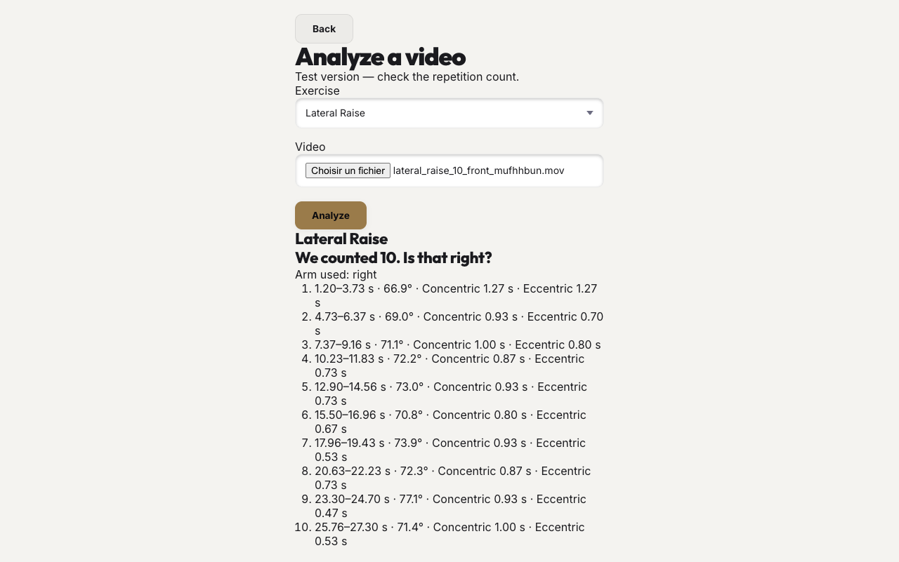
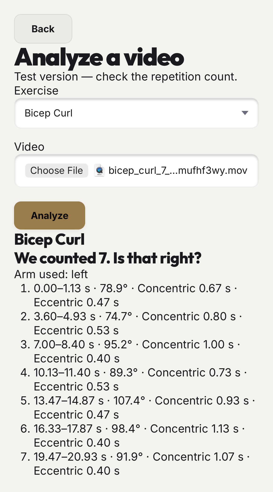
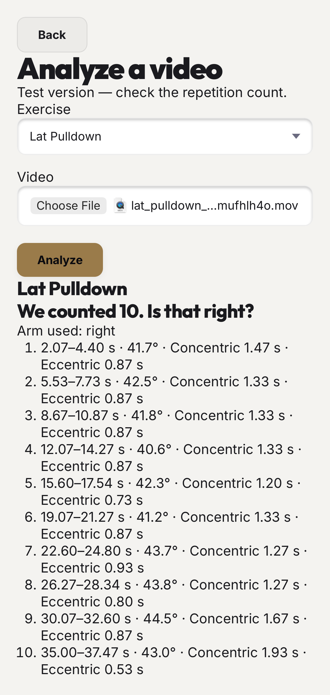
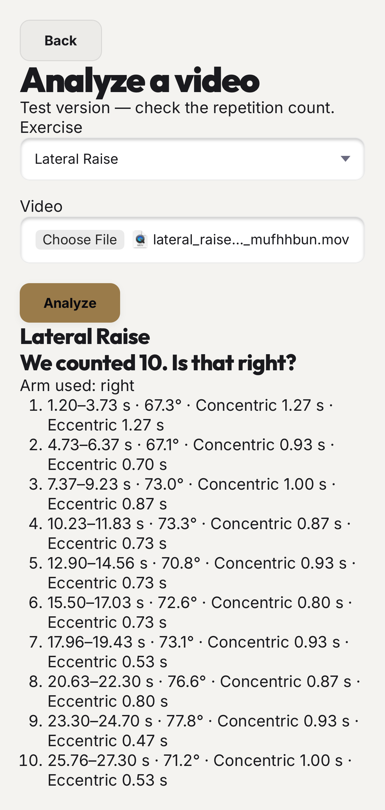
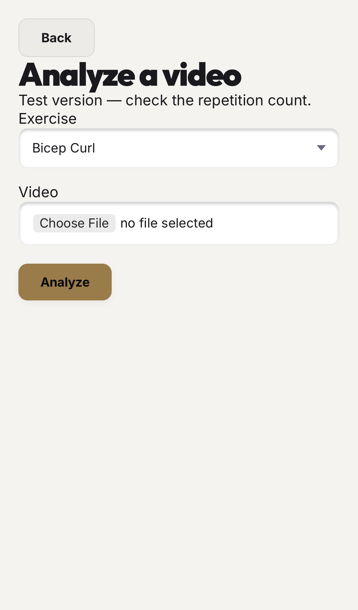
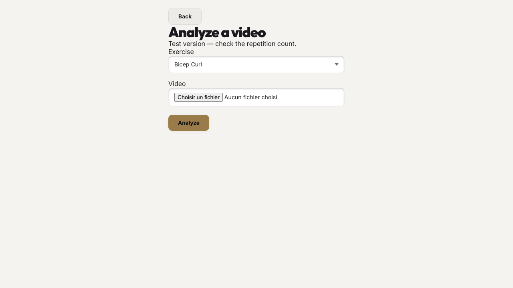

# Step 3 STOP — NOT PASSED

The approved lifts are wired to the unchanged core through worker-based pose inference. Both production browsers show the expected counts for the approved clips. Exact committed-landmark parity fails in Chrome, so Step 3 is not passed. The strict console test also fails on the lat-pulldown source timestamp diagnostic. Neither failure is skipped or marked expected.

## Changes

- PLAN.md records the git-lock stop rule, synthetic-first parameter rule, three-lift selector, parked presses and Step 3 STOP.
- The noisy-setup overhead-press synthetic test is it.fails with its reason. No core parameter changed.
- Analyze now requires curl, lateral raise or lat pulldown. Automatic and other lifts are absent. The old upload/counter code remains in the repository.
- Results show the count, verification question, chosen arm and per-rep core details. No form score is rendered. Only a strict majority of unavailable raw joint angles causes a counting refusal; technical failures are reported separately.
- The worker imports the harness’s shared CPU/IMAGE detection and filtering. Model and WASM are local. The existing decoding function and extraction settings are unchanged.
- The production worker uses the classic-worker bundle because MediaPipe’s loader failed in a module worker. The CSP now permits unsafe-eval because the existing WebCodecs/demuxer path was blocked by the production CSP; this weakens that script restriction and remains a build tradeoff to review.
- The worker maps only TFLite’s exact informational XNNPACK startup stderr line to console.info. Actual errors remain errors, including the demuxer timestamp diagnostic.
- Node type declarations were added for the existing TypeScript tests; typecheck now passes.

## Production results

The test seeds a completed local profile, then opens the real production Analyze screen. First-visit experience work is deferred. Bench/overhead clips are passed through the same lift-independent inference with curl selected solely to compare landmarks; their resulting curl counts are not presented as press results or approval.

| Browser | Clip | App count | Samples | Decoder | Seconds | Timestamps equal | Image equal | World equal | Console errors | Failed requests |
|---|---|---:|---:|---|---:|---|---|---|---:|---:|
| chrome | bench_press | not offered; parity only | 331 | webcodecs | 13.37 | true | false | false | 0 | 0 |
| chrome | bicep_curl | 7 | 341 | webcodecs | 12.954 | true | false | false | 0 | 0 |
| chrome | lat_pulldown | 10 | 609 | webcodecs | 18.856 | true | false | false | 1 | 0 |
| chrome | lateral_raise | 10 | 439 | webcodecs | 17.935 | true | false | false | 0 | 0 |
| chrome | overhead_press | not offered; parity only | 620 | webcodecs | 19.479 | true | false | false | 0 | 0 |
| webkit-iphone | bench_press | not offered; parity only | 331 | webcodecs | 13.975 | true | true | true | 0 | 0 |
| webkit-iphone | bicep_curl | 7 | 341 | webcodecs | 14.998 | true | true | true | 0 | 0 |
| webkit-iphone | lat_pulldown | 10 | 609 | webcodecs | 18.941 | true | true | true | 1 | 0 |
| webkit-iphone | lateral_raise | 10 | 439 | webcodecs | 19.062 | true | true | true | 0 | 0 |
| webkit-iphone | overhead_press | not offered; parity only | 620 | webcodecs | 20.978 | true | true | true | 0 | 0 |

The selector assertion reads every option from the DOM and requires exactly the placeholder, bicep_curl, lateral_raise and lat_pulldown. Backend validation also rejects Automatic and both parked presses.

## Console diagnostic (not suppressed)

**chrome / lat_pulldown**
```text
[mov,mp4,m4a,3gp,3g2,mj2 @ 0x9e300] Invalid timestamps stream=1, pts=24281, dts=24301, size=446
```

**webkit-iphone / lat_pulldown**
```text
[mov,mp4,m4a,3gp,3g2,mj2 @ 0x9e300] Invalid timestamps stream=1, pts=24281, dts=24301, size=446
```

ffprobe identifies stream 1 in this source as H.264 video. The cause of its invalid packet timestamps is unresolved; the source clip was not modified.

## Chrome diagnostic

Production worker compared with the main-thread development harness on the same Chrome installation, using curl. This is additional diagnosis, not a replacement for the production tests. It does not establish the cause of the difference.
```json
{
  "browser": "153.0.8010.53",
  "clip": "bicep_curl_7_side_mufhf3wy",
  "workerVsMain": {
    "timestamps": true,
    "imageLandmarks": false,
    "worldLandmarks": false
  },
  "mainVsCommitted": {
    "timestamps": true,
    "imageLandmarks": false,
    "worldLandmarks": false
  },
  "workerVsCommitted": {
    "timestamps": true,
    "imageLandmarks": false,
    "worldLandmarks": false
  },
  "workerCount": 7,
  "mainMetadata": {
    "fileName": "bicep_curl_7_side_mufhf3wy.mov",
    "fileSize": 71735378,
    "extractionMethod": "webcodecs",
    "extractedWidth": 360,
    "extractedHeight": 640,
    "duration": 22.766666999999998,
    "sampleCount": 341,
    "targetFps": 15,
    "maxLongSide": 640,
    "elapsedSeconds": 10.08,
    "modelLoadSeconds": 0.1,
    "midFrameIndex": 170,
    "midFrameWidth": 360,
    "midFrameHeight": 640,
    "peakOpenFrames": 1,
    "rotationDecision": "frame carries rotation=90, drawImage handles it",
    "poseCoverage": 1,
    "noseAboveHips": 1,
    "leftArmVisibility": 0.9765395894428153,
    "rightArmVisibility": 0.12316715542521994
  }
}
```

## Git / iCloud

xattr -l .git/index:
```text
com.apple.macl:
```
Foundation resource values:
```text
/Users/azeliebernard/Documents isUbiquitousItem= Optional(true)
/Users/azeliebernard/Documents/Lamine/workout-vision isUbiquitousItem= Optional(true)
/Users/azeliebernard/Documents/Lamine/workout-vision/.git/index isUbiquitousItem= Optional(true)
```
Documents also carries an iCloud Drive file-provider identifier and an iCloud desktop marker. The older CloudDocs/Documents path is absent. The Foundation result confirms that the repository and index are iCloud items, but does not prove that iCloud caused the previous locks. Older index 2 through index 6 files exist. No files were moved and no index-recovery command was run.

Tracked video files: 0

## Validation output

### unit-output.txt

```text

> workout-vision@1.4.0 test
> vitest run

(!) Your Vite config uses features that are unsupported by `configLoader: 'native'`, which is planned to become the default in a future major version of Vite:
  - `__dirname` (vite.config.js:7:30). Use `import.meta.dirname` instead
Set `VITE_CONFIG_NATIVE_IGNORE_WARNING=true` to suppress this warning.
5:46:47 PM [vite] warning: `esbuild` option was specified by "vite:react-babel" plugin. This option is deprecated, please use `oxc` instead.
5:46:47 PM [vite] warning: `optimizeDeps.esbuildOptions` option was specified by "vite:react-babel" plugin. This option is deprecated, please use `optimizeDeps.rolldownOptions` instead.
Both esbuild and oxc options were set. oxc options will be used and esbuild options will be ignored. The following esbuild options were set: `{ jsx: 'automatic', jsxImportSource: undefined }`
[copy-models] OK: MediaPipe tasks-vision WASM -> /Users/azeliebernard/Documents/Lamine/workout-vision/public/mediapipe (8 files)
[copy-models] OK: pose_landmarker_full.task already present

 RUN  v4.1.11 /Users/azeliebernard/Documents/Lamine/workout-vision


 Test Files  14 passed (14)
      Tests  247 passed | 1 expected fail (248)
   Start at  17:46:47
   Duration  527ms (transform 1.88s, setup 0ms, import 2.84s, tests 379ms, environment 1ms)
```

### core-output.txt

```text
(!) Your Vite config uses features that are unsupported by `configLoader: 'native'`, which is planned to become the default in a future major version of Vite:
  - `__dirname` (vite.config.js:7:30). Use `import.meta.dirname` instead
Set `VITE_CONFIG_NATIVE_IGNORE_WARNING=true` to suppress this warning.
5:46:23 PM [vite] warning: `esbuild` option was specified by "vite:react-babel" plugin. This option is deprecated, please use `oxc` instead.
5:46:23 PM [vite] warning: `optimizeDeps.esbuildOptions` option was specified by "vite:react-babel" plugin. This option is deprecated, please use `optimizeDeps.rolldownOptions` instead.
Both esbuild and oxc options were set. oxc options will be used and esbuild options will be ignored. The following esbuild options were set: `{ jsx: 'automatic', jsxImportSource: undefined }`
[copy-models] OK: MediaPipe tasks-vision WASM -> /Users/azeliebernard/Documents/Lamine/workout-vision/public/mediapipe (8 files)
[copy-models] OK: pose_landmarker_full.task already present

 RUN  v4.1.11 /Users/azeliebernard/Documents/Lamine/workout-vision

bench_press | expected=7 | hotfix=5 | new=2 | arm=right | confidence=39.0% | low=97.7° | high=140.8°
  rep 1: 11.13s–18.13s, ROM=98.6°, conc=5.93s, ecc=1.07s
  rep 2: 18.47s–20.20s, ROM=52.3°, conc=1.13s, ecc=0.60s
bicep_curl | expected=7 | hotfix=11 | new=7 | arm=left | confidence=95.9% | low=96.2° | high=153.7°
  rep 1: 0.00s–1.13s, ROM=78.9°, conc=0.67s, ecc=0.47s
  rep 2: 3.60s–4.93s, ROM=74.7°, conc=0.80s, ecc=0.53s
  rep 3: 7.00s–8.40s, ROM=95.2°, conc=1.00s, ecc=0.40s
  rep 4: 10.13s–11.40s, ROM=89.3°, conc=0.73s, ecc=0.53s
  rep 5: 13.47s–14.87s, ROM=107.4°, conc=0.93s, ecc=0.47s
  rep 6: 16.33s–17.87s, ROM=98.4°, conc=1.13s, ecc=0.40s
  rep 7: 19.47s–20.93s, ROM=91.9°, conc=1.07s, ecc=0.40s
lat_pulldown | expected=10 | hotfix=11 | new=10 | arm=right | confidence=97.5% | low=112.3° | high=141.6°
  rep 1: 2.07s–4.40s, ROM=41.7°, conc=1.47s, ecc=0.87s
  rep 2: 5.53s–7.73s, ROM=42.5°, conc=1.33s, ecc=0.87s
  rep 3: 8.67s–10.87s, ROM=41.8°, conc=1.33s, ecc=0.87s
  rep 4: 12.07s–14.27s, ROM=40.6°, conc=1.33s, ecc=0.87s
  rep 5: 15.60s–17.54s, ROM=42.3°, conc=1.20s, ecc=0.73s
  rep 6: 19.07s–21.27s, ROM=41.2°, conc=1.33s, ecc=0.87s
  rep 7: 22.60s–24.80s, ROM=43.7°, conc=1.27s, ecc=0.93s
  rep 8: 26.27s–28.34s, ROM=43.8°, conc=1.27s, ecc=0.80s
  rep 9: 30.07s–32.60s, ROM=44.5°, conc=1.67s, ecc=0.87s
  rep 10: 35.00s–37.47s, ROM=43.0°, conc=1.93s, ecc=0.53s
lateral_raise | expected=10 | hotfix=11 | new=10 | arm=right | confidence=100.0% | low=34.0° | high=82.6°
  rep 1: 1.20s–3.73s, ROM=67.3°, conc=1.27s, ecc=1.27s
  rep 2: 4.73s–6.37s, ROM=67.1°, conc=0.93s, ecc=0.70s
  rep 3: 7.37s–9.23s, ROM=73.0°, conc=1.00s, ecc=0.87s
  rep 4: 10.23s–11.83s, ROM=73.3°, conc=0.87s, ecc=0.73s
  rep 5: 12.90s–14.56s, ROM=70.8°, conc=0.93s, ecc=0.73s
  rep 6: 15.50s–17.03s, ROM=72.6°, conc=0.80s, ecc=0.73s
  rep 7: 17.96s–19.43s, ROM=73.1°, conc=0.93s, ecc=0.53s
  rep 8: 20.63s–22.30s, ROM=76.6°, conc=0.87s, ecc=0.80s
  rep 9: 23.30s–24.70s, ROM=77.8°, conc=0.93s, ecc=0.47s
  rep 10: 25.76s–27.30s, ROM=71.2°, conc=1.00s, ecc=0.53s
overhead_press | expected=10 | hotfix=22 | new=9 | arm=left | confidence=88.5% | low=109.9° | high=142.4°
  rep 1: 0.00s–5.94s, ROM=78.8°, conc=5.74s, ecc=0.20s
  rep 2: 6.01s–11.21s, ROM=75.4°, conc=4.74s, ecc=0.47s
  rep 3: 12.02s–14.69s, ROM=61.2°, conc=2.27s, ecc=0.40s
  rep 4: 15.95s–18.69s, ROM=55.8°, conc=2.34s, ecc=0.40s
  rep 5: 19.49s–22.29s, ROM=60.3°, conc=2.14s, ecc=0.67s
  rep 6: 23.29s–25.23s, ROM=50.6°, conc=1.40s, ecc=0.54s
  rep 7: 26.36s–28.27s, ROM=46.2°, conc=0.80s, ecc=1.10s
  rep 8: 28.40s–31.54s, ROM=68.4°, conc=2.67s, ecc=0.47s
  rep 9: 32.54s–38.54s, ROM=68.0°, conc=5.41s, ecc=0.60s

 Test Files  2 passed (2)
      Tests  22 passed | 1 expected fail (23)
   Start at  17:46:23
   Duration  221ms (transform 57ms, setup 0ms, import 76ms, tests 121ms, environment 0ms)
```

### typecheck-output.txt

```text

> workout-vision@1.4.0 typecheck
> tsc --noEmit
```

### lint-output.txt

```text
{
  "exitCode": 0,
  "stdout": "",
  "stderr": ""
}
```

### build-output.txt

```text

> workout-vision@1.4.0 prebuild
> node scripts/copy-models.js

[copy-models] OK: MediaPipe tasks-vision WASM -> /Users/azeliebernard/Documents/Lamine/workout-vision/public/mediapipe (8 files)
[copy-models] OK: pose_landmarker_full.task already present

> workout-vision@1.4.0 build
> vite build && node scripts/inject-sw-precache.js

vite v5.4.21 building for production...
[copy-models] OK: MediaPipe tasks-vision WASM -> /Users/azeliebernard/Documents/Lamine/workout-vision/public/mediapipe (8 files)
[copy-models] OK: pose_landmarker_full.task already present
transforming...
✓ 514 modules transformed.
rendering chunks...
computing gzip size...
dist/index.html                             2.97 kB │ gzip:   1.05 kB
dist/assets/poseWorker-DOf495x4.js        144.35 kB
dist/assets/corePoseWorker-t_fi2zBW.js    174.42 kB
dist/assets/Profile-DSM60F3w.css            2.21 kB │ gzip:   0.78 kB
dist/assets/WorkoutHistory-BWSnJ6m8.css     2.85 kB │ gzip:   0.99 kB
dist/assets/RestTimer-CS2fTymd.css          3.44 kB │ gzip:   1.31 kB
dist/assets/Landing-BpHTMkge.css            3.58 kB │ gzip:   1.13 kB
dist/assets/CoachReport-jw50fc85.css        3.85 kB │ gzip:   1.31 kB
dist/assets/ExerciseGuide-Cm39WDQj.css      4.31 kB │ gzip:   1.44 kB
dist/assets/Validate-miAs5MrC.css           5.67 kB │ gzip:   1.57 kB
dist/assets/index-s7sKwjQn.css             78.11 kB │ gzip:  14.74 kB
dist/assets/gpuBenchmark-CWotvkM8.js        2.02 kB │ gzip:   1.04 kB
dist/assets/RestTimer-CK_aR_Ab.js           5.08 kB │ gzip:   2.09 kB
dist/assets/PersonalRecords-C39HcC3Q.js     5.46 kB │ gzip:   2.11 kB
dist/assets/Landing-83NoH_xW.js             6.64 kB │ gzip:   2.52 kB
dist/assets/Onboarding-DoNLhVzs.js          9.90 kB │ gzip:   2.06 kB
dist/assets/ManualLog-BJGZ69ND.js          11.32 kB │ gzip:   3.60 kB
dist/assets/WeeklyReport-BPa5MdS6.js       14.11 kB │ gzip:   4.60 kB
dist/assets/CoreUpload-jc4feqxm.js         15.04 kB │ gzip:   6.47 kB
dist/assets/WorkoutHistory-K80ZcI7Y.js     21.36 kB │ gzip:   5.92 kB
dist/assets/Profile-DRGEfCcy.js            25.30 kB │ gzip:   6.82 kB
dist/assets/purify.es-BYftNTi7.js          29.40 kB │ gzip:  11.31 kB
dist/assets/localforage-53-gm4O1.js        29.67 kB │ gzip:   9.66 kB
dist/assets/LiveCapture-CVfygu36.js        32.14 kB │ gzip:  10.56 kB
dist/assets/ExerciseGuide-CxwlsbB4.js      33.16 kB │ gzip:   8.29 kB
dist/assets/Validate-DkTH4nDK.js           38.17 kB │ gzip:  13.14 kB
dist/assets/exerciseOntology-C4wWAdrX.js   65.35 kB │ gzip:  18.05 kB
dist/assets/i18n-DNQJuhpM.js               83.57 kB │ gzip:  28.85 kB
dist/assets/index-BKMdU-yt.js              95.37 kB │ gzip:  27.72 kB
dist/assets/fr-BmTGo6hN.js                109.69 kB │ gzip:  37.13 kB
dist/assets/web-demuxer-weuWD7o4.js       112.56 kB │ gzip:  43.51 kB
dist/assets/poseAnalysis-CqqVEkxP.js      150.04 kB │ gzip:  46.19 kB
dist/assets/index.es-Ccz12Tp2.js          151.01 kB │ gzip:  51.70 kB
dist/assets/exercises-DAWtkCPp.js         198.04 kB │ gzip:  33.71 kB
dist/assets/html2canvas.esm-BfxBtG_O.js   201.41 kB │ gzip:  48.03 kB
dist/assets/react-vendor-DCgi73_X.js      221.91 kB │ gzip:  68.77 kB
dist/assets/CoachReport-BK4pjPKi.js       413.92 kB │ gzip: 135.15 kB
✓ built in 1.60s
[inject-sw-precache] Injected 38 assets into SW (cache: wv-v6abfbd9d) — all assertions passed
```

### production-test-output.txt

```text
[WebServer] (node:18404) Warning: The 'NO_COLOR' env is ignored due to the 'FORCE_COLOR' env being set.
[WebServer] (Use `node --trace-warnings ...` to show where the warning was created)

Running 10 tests using 1 worker

(node:18414) Warning: The 'NO_COLOR' env is ignored due to the 'FORCE_COLOR' env being set.
(Use `node --trace-warnings ...` to show where the warning was created)
{"browser":"webkit-iphone","lift":"bicep_curl","expected":7,"mode":"approved app result","count":7,"refused":false,"samples":341,"elapsed":14.998,"decoder":"webcodecs","comparisons":{"timestamps":true,"imageLandmarks":true,"worldLandmarks":true},"screen":"Bicep Curl\nWe counted 7. Is that right?\n\nArm used: left\n\n0.00–1.13 s · 78.9° · Concentric 0.67 s · Eccentric 0.47 s\n3.60–4.93 s · 74.7° · Concentric 0.80 s · Eccentric 0.53 s\n7.00–8.40 s · 95.2° · Concentric 1.00 s · Eccentric 0.40 s\n10.13–11.40 s · 89.3° · Concentric 0.73 s · Eccentric 0.53 s\n13.47–14.87 s · 107.4° · Concentric 0.93 s · Eccentric 0.47 s\n16.33–17.87 s · 98.4° · Concentric 1.13 s · Eccentric 0.40 s\n19.47–20.93 s · 91.9° · Concentric 1.07 s · Eccentric 0.40 s","errors":[],"failed":[]}
  ✓   1 [webkit-iphone] › e2e/core-app.spec.js:19:3 › bicep_curl (17.2s)
{"browser":"webkit-iphone","lift":"lateral_raise","expected":10,"mode":"approved app result","count":10,"refused":false,"samples":439,"elapsed":19.062,"decoder":"webcodecs","comparisons":{"timestamps":true,"imageLandmarks":true,"worldLandmarks":true},"screen":"Lateral Raise\nWe counted 10. Is that right?\n\nArm used: right\n\n1.20–3.73 s · 67.3° · Concentric 1.27 s · Eccentric 1.27 s\n4.73–6.37 s · 67.1° · Concentric 0.93 s · Eccentric 0.70 s\n7.37–9.23 s · 73.0° · Concentric 1.00 s · Eccentric 0.87 s\n10.23–11.83 s · 73.3° · Concentric 0.87 s · Eccentric 0.73 s\n12.90–14.56 s · 70.8° · Concentric 0.93 s · Eccentric 0.73 s\n15.50–17.03 s · 72.6° · Concentric 0.80 s · Eccentric 0.73 s\n17.96–19.43 s · 73.1° · Concentric 0.93 s · Eccentric 0.53 s\n20.63–22.30 s · 76.6° · Concentric 0.87 s · Eccentric 0.80 s\n23.30–24.70 s · 77.8° · Concentric 0.93 s · Eccentric 0.47 s\n25.76–27.30 s · 71.2° · Concentric 1.00 s · Eccentric 0.53 s","errors":[],"failed":[]}
  ✓   2 [webkit-iphone] › e2e/core-app.spec.js:19:3 › lateral_raise (21.1s)
{"browser":"webkit-iphone","lift":"lat_pulldown","expected":10,"mode":"approved app result","count":10,"refused":false,"samples":609,"elapsed":18.941,"decoder":"webcodecs","comparisons":{"timestamps":true,"imageLandmarks":true,"worldLandmarks":true},"screen":"Lat Pulldown\nWe counted 10. Is that right?\n\nArm used: right\n\n2.07–4.40 s · 41.7° · Concentric 1.47 s · Eccentric 0.87 s\n5.53–7.73 s · 42.5° · Concentric 1.33 s · Eccentric 0.87 s\n8.67–10.87 s · 41.8° · Concentric 1.33 s · Eccentric 0.87 s\n12.07–14.27 s · 40.6° · Concentric 1.33 s · Eccentric 0.87 s\n15.60–17.54 s · 42.3° · Concentric 1.20 s · Eccentric 0.73 s\n19.07–21.27 s · 41.2° · Concentric 1.33 s · Eccentric 0.87 s\n22.60–24.80 s · 43.7° · Concentric 1.27 s · Eccentric 0.93 s\n26.27–28.34 s · 43.8° · Concentric 1.27 s · Eccentric 0.80 s\n30.07–32.60 s · 44.5° · Concentric 1.67 s · Eccentric 0.87 s\n35.00–37.47 s · 43.0° · Concentric 1.93 s · Eccentric 0.53 s","errors":["[mov,mp4,m4a,3gp,3g2,mj2 @ 0x9e300] Invalid timestamps stream=1, pts=24281, dts=24301, size=446"],"failed":[]}
  ✘   3 [webkit-iphone] › e2e/core-app.spec.js:19:3 › lat_pulldown (21.1s)
(node:18569) Warning: The 'NO_COLOR' env is ignored due to the 'FORCE_COLOR' env being set.
(Use `node --trace-warnings ...` to show where the warning was created)
{"browser":"webkit-iphone","lift":"bench_press","expected":null,"mode":"landmarks-only; curl selected","count":null,"refused":true,"samples":331,"elapsed":13.975,"decoder":"webcodecs","comparisons":{"timestamps":true,"imageLandmarks":true,"worldLandmarks":true},"screen":"Not offered; landmark check only","errors":[],"failed":[]}
  ✓   4 [webkit-iphone] › e2e/core-app.spec.js:19:3 › bench_press (15.8s)
{"browser":"webkit-iphone","lift":"overhead_press","expected":null,"mode":"landmarks-only; curl selected","count":null,"refused":false,"samples":620,"elapsed":20.978,"decoder":"webcodecs","comparisons":{"timestamps":true,"imageLandmarks":true,"worldLandmarks":true},"screen":"Not offered; landmark check only","errors":[],"failed":[]}
  ✓   5 [webkit-iphone] › e2e/core-app.spec.js:19:3 › overhead_press (23.1s)
(node:18616) Warning: The 'NO_COLOR' env is ignored due to the 'FORCE_COLOR' env being set.
(Use `node --trace-warnings ...` to show where the warning was created)
{"browser":"chrome","lift":"bicep_curl","expected":7,"mode":"approved app result","count":7,"refused":false,"samples":341,"elapsed":12.954,"decoder":"webcodecs","comparisons":{"timestamps":true,"imageLandmarks":false,"worldLandmarks":false},"screen":"Bicep Curl\nWe counted 7. Is that right?\n\nArm used: left\n\n0.00–1.20 s · 81.5° · Concentric 0.67 s · Eccentric 0.53 s\n3.60–4.93 s · 80.8° · Concentric 0.73 s · Eccentric 0.60 s\n5.00–8.33 s · 108.1° · Concentric 2.93 s · Eccentric 0.40 s\n8.40–11.40 s · 116.0° · Concentric 2.53 s · Eccentric 0.47 s\n13.40–14.87 s · 110.2° · Concentric 1.00 s · Eccentric 0.47 s\n16.33–17.87 s · 101.0° · Concentric 1.07 s · Eccentric 0.47 s\n19.47–21.00 s · 103.1° · Concentric 1.07 s · Eccentric 0.47 s","errors":[],"failed":[]}
  ✘   6 [chrome] › e2e/core-app.spec.js:19:3 › bicep_curl (15.0s)
(node:18649) Warning: The 'NO_COLOR' env is ignored due to the 'FORCE_COLOR' env being set.
(Use `node --trace-warnings ...` to show where the warning was created)
{"browser":"chrome","lift":"lateral_raise","expected":10,"mode":"approved app result","count":10,"refused":false,"samples":439,"elapsed":17.935,"decoder":"webcodecs","comparisons":{"timestamps":true,"imageLandmarks":false,"worldLandmarks":false},"screen":"Lateral Raise\nWe counted 10. Is that right?\n\nArm used: right\n\n1.20–3.73 s · 66.9° · Concentric 1.27 s · Eccentric 1.27 s\n4.73–6.37 s · 69.0° · Concentric 0.93 s · Eccentric 0.70 s\n7.37–9.16 s · 71.1° · Concentric 1.00 s · Eccentric 0.80 s\n10.23–11.83 s · 72.2° · Concentric 0.87 s · Eccentric 0.73 s\n12.90–14.56 s · 73.0° · Concentric 0.93 s · Eccentric 0.73 s\n15.50–16.96 s · 70.8° · Concentric 0.80 s · Eccentric 0.67 s\n17.96–19.43 s · 73.9° · Concentric 0.93 s · Eccentric 0.53 s\n20.63–22.23 s · 72.3° · Concentric 0.87 s · Eccentric 0.73 s\n23.30–24.70 s · 77.1° · Concentric 0.93 s · Eccentric 0.47 s\n25.76–27.30 s · 71.4° · Concentric 1.00 s · Eccentric 0.53 s","errors":[],"failed":[]}
  ✘   7 [chrome] › e2e/core-app.spec.js:19:3 › lateral_raise (19.4s)
(node:18732) Warning: The 'NO_COLOR' env is ignored due to the 'FORCE_COLOR' env being set.
(Use `node --trace-warnings ...` to show where the warning was created)
{"browser":"chrome","lift":"lat_pulldown","expected":10,"mode":"approved app result","count":10,"refused":false,"samples":609,"elapsed":18.856,"decoder":"webcodecs","comparisons":{"timestamps":true,"imageLandmarks":false,"worldLandmarks":false},"screen":"Lat Pulldown\nWe counted 10. Is that right?\n\nArm used: right\n\n2.07–4.33 s · 41.8° · Concentric 1.40 s · Eccentric 0.87 s\n5.47–7.73 s · 46.3° · Concentric 1.40 s · Eccentric 0.87 s\n8.60–10.93 s · 44.1° · Concentric 1.33 s · Eccentric 1.00 s\n12.07–14.27 s · 42.1° · Concentric 1.27 s · Eccentric 0.93 s\n15.60–17.67 s · 44.3° · Concentric 1.20 s · Eccentric 0.87 s\n19.07–21.27 s · 41.4° · Concentric 1.33 s · Eccentric 0.87 s\n22.60–24.80 s · 47.2° · Concentric 1.27 s · Eccentric 0.93 s\n26.27–28.34 s · 45.6° · Concentric 1.27 s · Eccentric 0.80 s\n30.07–32.53 s · 44.7° · Concentric 1.60 s · Eccentric 0.87 s\n34.94–37.53 s · 43.3° · Concentric 1.93 s · Eccentric 0.67 s","errors":["[mov,mp4,m4a,3gp,3g2,mj2 @ 0x9e300] Invalid timestamps stream=1, pts=24281, dts=24301, size=446"],"failed":[]}
  ✘   8 [chrome] › e2e/core-app.spec.js:19:3 › lat_pulldown (23.8s)
(node:18775) Warning: The 'NO_COLOR' env is ignored due to the 'FORCE_COLOR' env being set.
(Use `node --trace-warnings ...` to show where the warning was created)
{"browser":"chrome","lift":"bench_press","expected":null,"mode":"landmarks-only; curl selected","count":null,"refused":true,"samples":331,"elapsed":13.37,"decoder":"webcodecs","comparisons":{"timestamps":true,"imageLandmarks":false,"worldLandmarks":false},"screen":"Not offered; landmark check only","errors":[],"failed":[]}
  ✘   9 [chrome] › e2e/core-app.spec.js:19:3 › bench_press (14.6s)
(node:18854) Warning: The 'NO_COLOR' env is ignored due to the 'FORCE_COLOR' env being set.
(Use `node --trace-warnings ...` to show where the warning was created)
{"browser":"chrome","lift":"overhead_press","expected":null,"mode":"landmarks-only; curl selected","count":null,"refused":false,"samples":620,"elapsed":19.479,"decoder":"webcodecs","comparisons":{"timestamps":true,"imageLandmarks":false,"worldLandmarks":false},"screen":"Not offered; landmark check only","errors":[],"failed":[]}
  ✘  10 [chrome] › e2e/core-app.spec.js:19:3 › overhead_press (21.6s)


  1) [webkit-iphone] › e2e/core-app.spec.js:19:3 › lat_pulldown ────────────────────────────────────

    Error: expect(received).toEqual(expected) // deep equality

    - Expected  - 1
    + Received  + 3

    - Array []
    + Array [
    +   "[mov,mp4,m4a,3gp,3g2,mj2 @ 0x9e300] Invalid timestamps stream=1, pts=24281, dts=24301, size=446",
    + ]

      71 |     }
      72 |     expect(comparisons).toEqual({ timestamps: true, imageLandmarks: true, worldLandmarks: true });
    > 73 |     expect(errors).toEqual([]);
         |                    ^
      74 |     expect(failed).toEqual([]);
      75 |   });
      76 | }
        at /Users/azeliebernard/Documents/Lamine/workout-vision/e2e/core-app.spec.js:73:20

    Error Context: test-results/core-app-lat-pulldown-webkit-iphone/error-context.md

  2) [chrome] › e2e/core-app.spec.js:19:3 › bicep_curl ─────────────────────────────────────────────

    Error: expect(received).toEqual(expected) // deep equality

    - Expected  - 2
    + Received  + 2

      Object {
    -   "imageLandmarks": true,
    +   "imageLandmarks": false,
        "timestamps": true,
    -   "worldLandmarks": true,
    +   "worldLandmarks": false,
      }

      70 |       expect(actual.refused).toBe(false);
      71 |     }
    > 72 |     expect(comparisons).toEqual({ timestamps: true, imageLandmarks: true, worldLandmarks: true });
         |                         ^
      73 |     expect(errors).toEqual([]);
      74 |     expect(failed).toEqual([]);
      75 |   });
        at /Users/azeliebernard/Documents/Lamine/workout-vision/e2e/core-app.spec.js:72:25

    Error Context: test-results/core-app-bicep-curl-chrome/error-context.md

  3) [chrome] › e2e/core-app.spec.js:19:3 › lateral_raise ──────────────────────────────────────────

    Error: expect(received).toEqual(expected) // deep equality

    - Expected  - 2
    + Received  + 2

      Object {
    -   "imageLandmarks": true,
    +   "imageLandmarks": false,
        "timestamps": true,
    -   "worldLandmarks": true,
    +   "worldLandmarks": false,
      }

      70 |       expect(actual.refused).toBe(false);
      71 |     }
    > 72 |     expect(comparisons).toEqual({ timestamps: true, imageLandmarks: true, worldLandmarks: true });
         |                         ^
      73 |     expect(errors).toEqual([]);
      74 |     expect(failed).toEqual([]);
      75 |   });
        at /Users/azeliebernard/Documents/Lamine/workout-vision/e2e/core-app.spec.js:72:25

    Error Context: test-results/core-app-lateral-raise-chrome/error-context.md

  4) [chrome] › e2e/core-app.spec.js:19:3 › lat_pulldown ───────────────────────────────────────────

    Error: expect(received).toEqual(expected) // deep equality

    - Expected  - 2
    + Received  + 2

      Object {
    -   "imageLandmarks": true,
    +   "imageLandmarks": false,
        "timestamps": true,
    -   "worldLandmarks": true,
    +   "worldLandmarks": false,
      }

      70 |       expect(actual.refused).toBe(false);
      71 |     }
    > 72 |     expect(comparisons).toEqual({ timestamps: true, imageLandmarks: true, worldLandmarks: true });
         |                         ^
      73 |     expect(errors).toEqual([]);
      74 |     expect(failed).toEqual([]);
      75 |   });
        at /Users/azeliebernard/Documents/Lamine/workout-vision/e2e/core-app.spec.js:72:25

    Error Context: test-results/core-app-lat-pulldown-chrome/error-context.md

  5) [chrome] › e2e/core-app.spec.js:19:3 › bench_press ────────────────────────────────────────────

    Error: expect(received).toEqual(expected) // deep equality

    - Expected  - 2
    + Received  + 2

      Object {
    -   "imageLandmarks": true,
    +   "imageLandmarks": false,
        "timestamps": true,
    -   "worldLandmarks": true,
    +   "worldLandmarks": false,
      }

      70 |       expect(actual.refused).toBe(false);
      71 |     }
    > 72 |     expect(comparisons).toEqual({ timestamps: true, imageLandmarks: true, worldLandmarks: true });
         |                         ^
      73 |     expect(errors).toEqual([]);
      74 |     expect(failed).toEqual([]);
      75 |   });
        at /Users/azeliebernard/Documents/Lamine/workout-vision/e2e/core-app.spec.js:72:25

    Error Context: test-results/core-app-bench-press-chrome/error-context.md

  6) [chrome] › e2e/core-app.spec.js:19:3 › overhead_press ─────────────────────────────────────────

    Error: expect(received).toEqual(expected) // deep equality

    - Expected  - 2
    + Received  + 2

      Object {
    -   "imageLandmarks": true,
    +   "imageLandmarks": false,
        "timestamps": true,
    -   "worldLandmarks": true,
    +   "worldLandmarks": false,
      }

      70 |       expect(actual.refused).toBe(false);
      71 |     }
    > 72 |     expect(comparisons).toEqual({ timestamps: true, imageLandmarks: true, worldLandmarks: true });
         |                         ^
      73 |     expect(errors).toEqual([]);
      74 |     expect(failed).toEqual([]);
      75 |   });
        at /Users/azeliebernard/Documents/Lamine/workout-vision/e2e/core-app.spec.js:72:25

    Error Context: test-results/core-app-overhead-press-chrome/error-context.md

  6 failed
    [webkit-iphone] › e2e/core-app.spec.js:19:3 › lat_pulldown ─────────────────────────────────────
    [chrome] › e2e/core-app.spec.js:19:3 › bicep_curl ──────────────────────────────────────────────
    [chrome] › e2e/core-app.spec.js:19:3 › lateral_raise ───────────────────────────────────────────
    [chrome] › e2e/core-app.spec.js:19:3 › lat_pulldown ────────────────────────────────────────────
    [chrome] › e2e/core-app.spec.js:19:3 › bench_press ─────────────────────────────────────────────
    [chrome] › e2e/core-app.spec.js:19:3 › overhead_press ──────────────────────────────────────────
  4 passed (3.3m)
```

## Screenshots and exact screen text

### chrome / bicep_curl



```text
Bicep Curl
We counted 7. Is that right?

Arm used: left

0.00–1.20 s · 81.5° · Concentric 0.67 s · Eccentric 0.53 s
3.60–4.93 s · 80.8° · Concentric 0.73 s · Eccentric 0.60 s
5.00–8.33 s · 108.1° · Concentric 2.93 s · Eccentric 0.40 s
8.40–11.40 s · 116.0° · Concentric 2.53 s · Eccentric 0.47 s
13.40–14.87 s · 110.2° · Concentric 1.00 s · Eccentric 0.47 s
16.33–17.87 s · 101.0° · Concentric 1.07 s · Eccentric 0.47 s
19.47–21.00 s · 103.1° · Concentric 1.07 s · Eccentric 0.47 s
```

### chrome / lat_pulldown



```text
Lat Pulldown
We counted 10. Is that right?

Arm used: right

2.07–4.33 s · 41.8° · Concentric 1.40 s · Eccentric 0.87 s
5.47–7.73 s · 46.3° · Concentric 1.40 s · Eccentric 0.87 s
8.60–10.93 s · 44.1° · Concentric 1.33 s · Eccentric 1.00 s
12.07–14.27 s · 42.1° · Concentric 1.27 s · Eccentric 0.93 s
15.60–17.67 s · 44.3° · Concentric 1.20 s · Eccentric 0.87 s
19.07–21.27 s · 41.4° · Concentric 1.33 s · Eccentric 0.87 s
22.60–24.80 s · 47.2° · Concentric 1.27 s · Eccentric 0.93 s
26.27–28.34 s · 45.6° · Concentric 1.27 s · Eccentric 0.80 s
30.07–32.53 s · 44.7° · Concentric 1.60 s · Eccentric 0.87 s
34.94–37.53 s · 43.3° · Concentric 1.93 s · Eccentric 0.67 s
```

### chrome / lateral_raise



```text
Lateral Raise
We counted 10. Is that right?

Arm used: right

1.20–3.73 s · 66.9° · Concentric 1.27 s · Eccentric 1.27 s
4.73–6.37 s · 69.0° · Concentric 0.93 s · Eccentric 0.70 s
7.37–9.16 s · 71.1° · Concentric 1.00 s · Eccentric 0.80 s
10.23–11.83 s · 72.2° · Concentric 0.87 s · Eccentric 0.73 s
12.90–14.56 s · 73.0° · Concentric 0.93 s · Eccentric 0.73 s
15.50–16.96 s · 70.8° · Concentric 0.80 s · Eccentric 0.67 s
17.96–19.43 s · 73.9° · Concentric 0.93 s · Eccentric 0.53 s
20.63–22.23 s · 72.3° · Concentric 0.87 s · Eccentric 0.73 s
23.30–24.70 s · 77.1° · Concentric 0.93 s · Eccentric 0.47 s
25.76–27.30 s · 71.4° · Concentric 1.00 s · Eccentric 0.53 s
```

### webkit-iphone / bicep_curl



```text
Bicep Curl
We counted 7. Is that right?

Arm used: left

0.00–1.13 s · 78.9° · Concentric 0.67 s · Eccentric 0.47 s
3.60–4.93 s · 74.7° · Concentric 0.80 s · Eccentric 0.53 s
7.00–8.40 s · 95.2° · Concentric 1.00 s · Eccentric 0.40 s
10.13–11.40 s · 89.3° · Concentric 0.73 s · Eccentric 0.53 s
13.47–14.87 s · 107.4° · Concentric 0.93 s · Eccentric 0.47 s
16.33–17.87 s · 98.4° · Concentric 1.13 s · Eccentric 0.40 s
19.47–20.93 s · 91.9° · Concentric 1.07 s · Eccentric 0.40 s
```

### webkit-iphone / lat_pulldown



```text
Lat Pulldown
We counted 10. Is that right?

Arm used: right

2.07–4.40 s · 41.7° · Concentric 1.47 s · Eccentric 0.87 s
5.53–7.73 s · 42.5° · Concentric 1.33 s · Eccentric 0.87 s
8.67–10.87 s · 41.8° · Concentric 1.33 s · Eccentric 0.87 s
12.07–14.27 s · 40.6° · Concentric 1.33 s · Eccentric 0.87 s
15.60–17.54 s · 42.3° · Concentric 1.20 s · Eccentric 0.73 s
19.07–21.27 s · 41.2° · Concentric 1.33 s · Eccentric 0.87 s
22.60–24.80 s · 43.7° · Concentric 1.27 s · Eccentric 0.93 s
26.27–28.34 s · 43.8° · Concentric 1.27 s · Eccentric 0.80 s
30.07–32.60 s · 44.5° · Concentric 1.67 s · Eccentric 0.87 s
35.00–37.47 s · 43.0° · Concentric 1.93 s · Eccentric 0.53 s
```

### webkit-iphone / lateral_raise



```text
Lateral Raise
We counted 10. Is that right?

Arm used: right

1.20–3.73 s · 67.3° · Concentric 1.27 s · Eccentric 1.27 s
4.73–6.37 s · 67.1° · Concentric 0.93 s · Eccentric 0.70 s
7.37–9.23 s · 73.0° · Concentric 1.00 s · Eccentric 0.87 s
10.23–11.83 s · 73.3° · Concentric 0.87 s · Eccentric 0.73 s
12.90–14.56 s · 70.8° · Concentric 0.93 s · Eccentric 0.73 s
15.50–17.03 s · 72.6° · Concentric 0.80 s · Eccentric 0.73 s
17.96–19.43 s · 73.1° · Concentric 0.93 s · Eccentric 0.53 s
20.63–22.30 s · 76.6° · Concentric 0.87 s · Eccentric 0.80 s
23.30–24.70 s · 77.8° · Concentric 0.93 s · Eccentric 0.47 s
25.76–27.30 s · 71.2° · Concentric 1.00 s · Eccentric 0.53 s
```

### Selector





STOP. No main change, deployment, Step 3a, experience work or preview was performed. Step 3 remains unpassed pending resolution of the landmark-equality failure.
